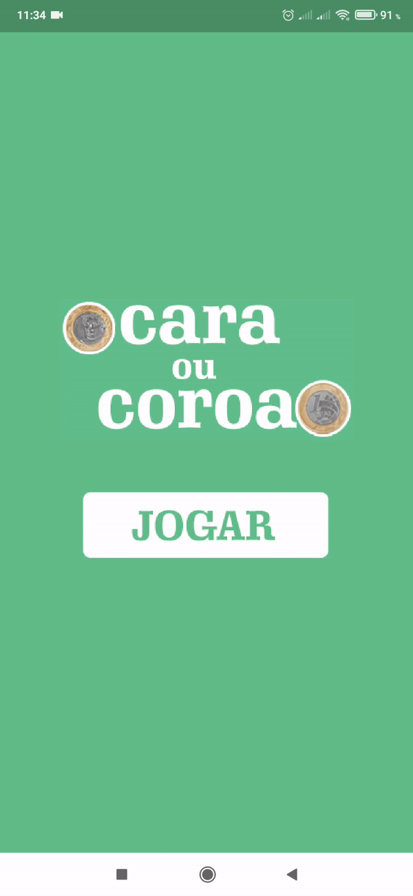
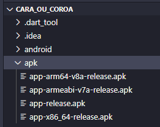

# 💻 Cara ou Coroa

📱 Projeto desenvolvido com o objetivo de aprender Flutter.
 
🏷️ App 4 - Cara ou Coroa do [curso](https://www.udemy.com/course/desenvolvimento-android-e-ios-com-flutter/) de desenvolvimento com Flutter.

---

Demonstração do app:

---

🧪 Para testar o app basta instalar uma das apk's disponíveis na pasta apk do projeto.

 

🙏 Qualquer sugestão e melhoria é muito bem vinda!
